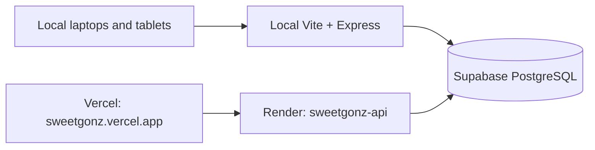

# Sweet Gonz Kiosk

Sweet Gonz is a supervised restaurant-ordering pilot for Sweet Gonz Bakeshop
Cafe. It provides a bilingual customer kiosk, admin console, cashier queue,
kitchen display, serving counter, public order board, reports, SOA export, and
audit history.

The application supports simulated e-wallet payments only. It is not a real
payment terminal and must not be used to collect card, bank, GCash, or Maya
credentials.

## Architecture

The preferred demo path is local access. The hosted path is a prepared fallback
using the same Supabase PostgreSQL database, so changing from local URLs to the
cloud URL does not require merging two order histories.



- Vercel hosts the React/Vite interface.
- Render hosts the Express API, sessions, workflow rules, reporting, and SSE.
- Supabase stores the private `app` schema and is accessed by the backend only.
- SQLite remains available for rollback and offline/local recovery tooling. It
  is not the runtime provider after the PostgreSQL cutover.

## Roles and routes

| Surface               | Route            |
| --------------------- | ---------------- |
| Customer kiosk        | `/kiosk`         |
| Admin console         | `/admin`         |
| Cashier               | `/staff/cashier` |
| Kitchen               | `/staff/kitchen` |
| Serving counter       | `/staff/serving` |
| Customer order board  | `/order-board`   |
| Cloud standby monitor | `/admin/standby` |

The whole-order flow is:

```text
Kiosk -> Cashier payment -> Kitchen preparation -> Serving counter -> Completed
```

Cash orders wait for payment confirmation. Simulated wallet orders are already
paid and enter the kitchen queue. The preparation timer starts only when the
order becomes `preparing`.

## Requirements

- Node.js 20 or newer
- npm 9 or newer
- Git
- A Supabase project for the shared PostgreSQL deployment
- Render and Vercel accounts for the hosted fallback

## Local installation

```powershell
npm ci
Copy-Item .env.example .env
npm run db:migrate
npm run db:seed
npm run admin:create
```

Use `cp .env.example .env` in Bash or WSL. Keep `.env` private. Create staff
accounts interactively; never seed passwords into the repository.

For the SQLite rollback path, leave `DATABASE_PROVIDER=sqlite`. For the shared
database path, set these private values in `.env`:

```dotenv
DATABASE_PROVIDER=postgres
DATABASE_URL=<private-supabase-connection-string>
PGSSL=true
DEPLOYMENT_ID=local-primary
```

The database URL is used only by Express. Do not add it to Vercel or any
`VITE_*` variable.

## Run the local demo

Start the API in one terminal:

```powershell
npm run dev:server
```

Start Vite in another terminal. To allow tablets and phones on the same private
LAN, expose only Vite on the LAN:

```powershell
npm run dev -w apps/web -- --host 0.0.0.0
```

Open the local machine's LAN address on each device. The API remains behind the
Vite proxy. Do not expose port 4000 directly and do not enable router port
forwarding.

## Hosted fallback deployment

### 1. Supabase

Create a free project named `sweetgonz-db`, preferably in Singapore. Apply the
PostgreSQL migration through the migration command or SQL editor, then create a
least-privilege runtime role for the backend. Keep the migration-owner
credential separate from the Render runtime credential.

Configure the runtime role with access to the private `app` schema only. The
grant template is [deploy/supabase-runtime-grants.sql](deploy/supabase-runtime-grants.sql).
The Supabase Data API is not used by this application; the browser never
receives a database key.

Run the full-data import from the existing SQLite pilot database only after
creating a verified backup:

```powershell
$env:DATABASE_PROVIDER = "postgres"
$env:DATABASE_URL = "<private-supabase-connection-string>"
npm run db:import:postgres
```

The importer copies catalog data, staff accounts and bcrypt hashes, orders,
order items, and audit history. Active sessions are intentionally discarded.
It prints table counts and completed-sales reconciliation and stops if the
target already contains data unless `--replace` is explicitly supplied.

### 2. Render

Create the `sweetgonz-api` web service from `render.yaml`. Set these secrets in
Render, never in Git:

- `DATABASE_URL`
- `MIGRATION_DATABASE_URL` (migration-owner connection kept separate from the runtime role)
- `SESSION_SECRET` (at least 32 random characters)

The service binds to Render's `PORT`, runs the idempotent migration command at
boot, and serves API routes only. Its health check is `/api/v1/health`.

### 3. Vercel

Create a Vercel project named `sweetgonz` from the repository root. The build
configuration is already in `vercel.json`:

- install: `npm ci`
- build: `npm run build -w apps/web`
- output: `apps/web/dist`
- preferred URL: `https://sweetgonz.vercel.app`
- fallback URL: `https://sweetgonz-kiosk.vercel.app`

The `/api/*` rewrite keeps the browser on the Vercel origin while forwarding
requests to Render. If Render assigns a different hostname, update the
destination in `vercel.json` before the production deployment.

No database or session secrets belong in Vercel because it only serves the
frontend in this architecture.

## Demo failover runbook

1. Open `https://sweetgonz.vercel.app/admin/login` on a spare device.
2. Sign in as an administrator and open `/admin/standby`.
3. Leave that page open; it checks the cloud health endpoint once per minute so
   the free Render service remains warm.
4. Run the normal demo through local URLs.
5. If the local server fails, stop submitting new local orders and open the
   equivalent Vercel route on each station device.
6. Confirm the cloud health indicator is ready before resuming transactions.
7. After the demo, export the SOA and review audit events by deployment ID.

If the standby monitor was not open, Render may need a cold start. Free-tier
hosting cannot guarantee instant failover.

## Verification

```powershell
npm run build
npm test
npm run lint
npm run format:check
npm run healthcheck
```

For browser verification:

```powershell
npm run test:e2e
```

Verify the full chain with separate sessions: kiosk order, cash confirmation,
kitchen preparation, ready handoff, serving completion, public-board dwell,
report/SOA export, and audit history. Test desktop, tablet landscape, tablet
portrait, and 390px phone layouts.

## Security and operational boundaries

- Sessions are server-side, `HttpOnly`, `SameSite=Strict`, and secure in hosted
  mode.
- CSRF tokens, role checks, optimistic versions, rate limits, origin checks,
  CSP, and request IDs remain enabled.
- Public order-board responses expose anonymous order numbers and public status
  only.
- Receipt tokens are returned once and stored only as hashes.
- Amounts are integer centavos; customer prices are never trusted from the
  browser.
- No credentials, database files, backups, IP addresses, tokens, logs, or
  customer records belong in Git.
- This is a supervised single-site pilot. Printers, real payment gateways,
  SMS, multi-branch routing, and active-active failover are out of scope.

## Documentation

- [Architecture](docs/ARCHITECTURE.md)
- [Deployment](docs/DEPLOYMENT.md)
- [API reference](docs/API.md)
- [Database dictionary](docs/DATABASE_DICTIONARY.md)
- [Backup and restore](docs/BACKUP_RESTORE.md)
- [Admin/operator manual](docs/ADMIN_OPERATOR_MANUAL.md)
- [Test plan](docs/TEST_PLAN.md)
- [Known limitations](docs/KNOWN_LIMITATIONS.md)
- [Contributing](CONTRIBUTING.md)
- [MIT license](LICENSE)

## License

This project is licensed under the MIT License. See [LICENSE](LICENSE).
