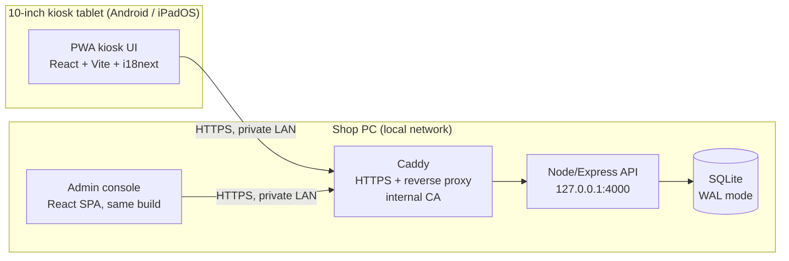
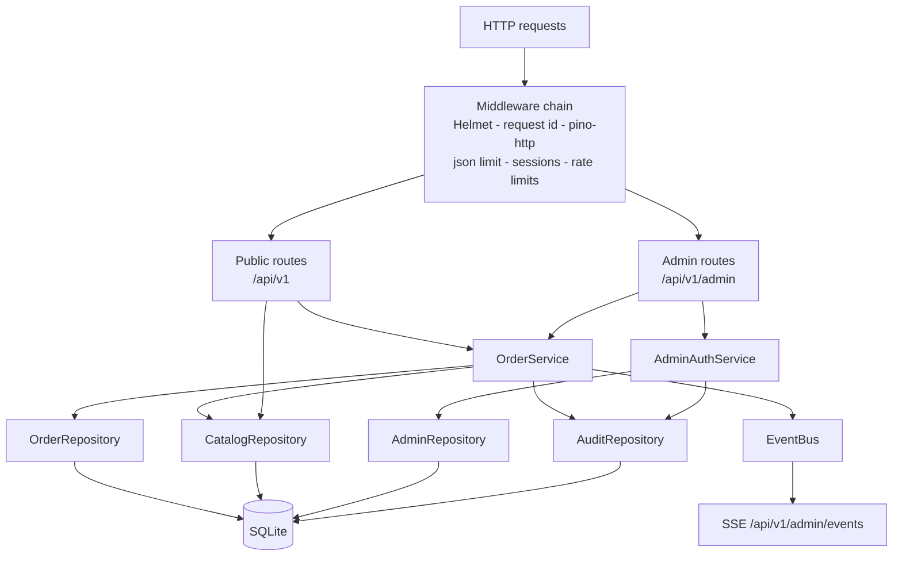
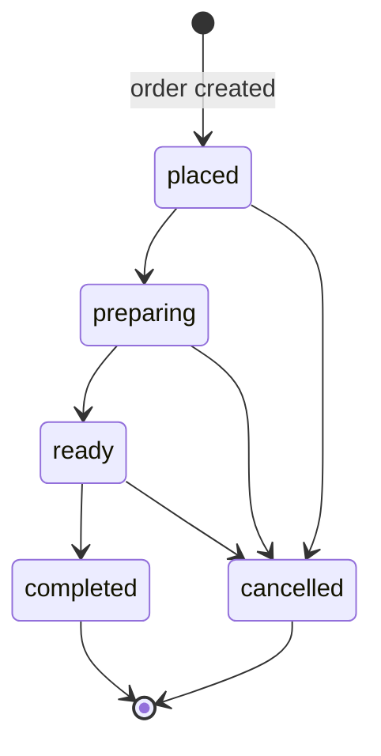
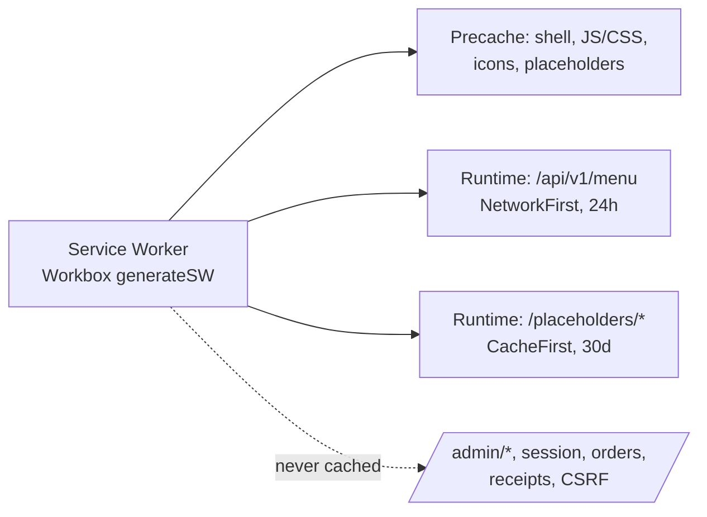
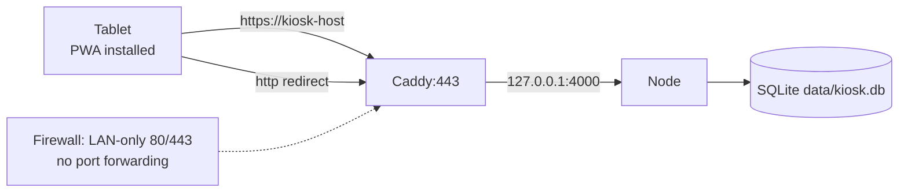

# Architecture

## 1. System overview



- The browser apps are the same Vite build (customer kiosk + admin console).
- In development the Vite dev server proxies `/api` to the Node server;
  in production Caddy terminates HTTPS and proxies to Node on localhost.
- Node binds `127.0.0.1` only; it is never exposed to the LAN directly.

## 2. Monorepo layout

```
apps/web        React 18 + Vite 5 SPA/PWA (kiosk + admin), e2e tests
apps/server     Express 4 API, better-sqlite3, domain services, tests
packages/shared Zod schemas, constants, error codes, money, seed menu
scripts         CLI tooling (migrate, seed, reset, admin, backup, restore,
                healthcheck, benchmark, placeholder generation)
deploy          Caddyfile.example
docs            Documentation
data            Live SQLite DB (gitignored)
backups         Timestamped backups (gitignored)
```

## 3. Server architecture



### 3.1 Request flow (order creation)

1. Route parses + validates the body with Zod (`createOrderSchema`).
2. `Idempotency-Key` header is validated (8–128 chars).
3. Existing key → return the original order (200, `duplicate: true`).
4. Otherwise an **IMMEDIATE transaction**:
   - loads current products/add-ons/options from the DB,
   - validates availability, add-on compatibility, required options,
     quantity limits (client prices ignored),
   - allocates `SG-YYYYMMDD-NNN` (Asia/Manila business date + max
     daily_sequence + 1),
   - inserts the order + item snapshots + add-on/option snapshots,
     storing only `sha256(receiptToken)`.
5. After commit: audit row + `OrderCreated` event on the EventBus.
6. Response: 201 with order, totals, receipt token.

### 3.2 Idempotency and concurrency

- Unique constraints: `order_number`, `(business_date, daily_sequence)`,
  `idempotency_key` (all verified by integration tests).
- The immediate transaction prevents two concurrent checkouts from
  allocating the same sequence (verified with 5×3 concurrent inserts).
- Admin mutations carry `version`; mismatches return 409 with the newest
  state (optimistic concurrency).

### 3.3 Events

- In-process `EventBus` with a bounded backlog (200) feeds SSE clients.
- SSE route replays the backlog on connect, then streams live events with
  15 s heartbeats; the admin UI falls back to 5 s polling on errors.

## 4. Web architecture

### 4.1 Kiosk

- `CartProvider` context holds the cart; persists to `sessionStorage`
  (`sgkiosk.cart.v1`); merges identical configurations; recomputes line
  totals from per-unit totals (base + add-ons + options).
- Order submission stores an idempotency key in `sessionStorage`
  (`sgkiosk.idempotency.v1`); network retries reuse it; duplicates show the
  original order.
- Idle timer: 105 s warn / 15 s grace / 120 s reset; suppressed while a
  submission is in flight.
- `useServerStatus` polls `/api/v1/health` every 10 s; offline state
  preserves the cart and disables checkout.
- i18next with `en`/`fil`; English is the per-session default.

### 4.2 Admin

- `AdminLayout` guards `/admin/*` via `GET /admin/session`; CSRF token held
  in memory only; language preference in `localStorage`.
- `useAdminLive` subscribes to SSE with 5 s polling fallback for summary +
  order lists.
- Order detail performs status/payment mutations with the order `version`;
  409 responses refresh the displayed state with the newest order.

## 5. State machines



Payment states: cash `pending_cash → cash_received`; demo stays
`demo_confirmed` (simulated). Completion requires confirmed payment.

## 6. Security architecture

- Helmet defaults + strict CSP (`frame-ancestors 'none'`, same-origin only).
- Body size limit 100 KB; JSON parsing errors → 400 envelope.
- General per-IP API rate limit (300/min default) + login limiter (5 failed
  per IP+username per 15 min, reset on success).
- Sessions in SQLite (`admin_sessions`), 30-min rolling inactivity, 8-hour
  absolute cap, httpOnly + SameSite=Strict + Secure (HTTPS mode).
- CSRF: token issued at login, stored server-side in the session, required
  via `X-CSRF-Token` on all authenticated mutations.
- `Cache-Control: no-store` on all admin responses; public menu cacheable
  (max-age 5 s) for PWA offline display.
- Production startup guard: `NODE_ENV=production` requires
  `COOKIE_SECURE=true`, `TRUST_PROXY=true`, and a ≥32-char `SESSION_SECRET`.
- Receipt tokens are opaque, returned once, stored hashed; wrong tokens are
  indistinguishable from missing receipts (404).
- Audit logging with request IDs; secrets never logged (pino redaction).

## 7. PWA / caching boundaries



## 8. Deployment topology



See DEPLOYMENT.md for certificate trust on Android/iPadOS and device
locking instructions.

## 9. Key decisions and rationale

| Decision                          | Rationale                                                                                     |
| --------------------------------- | --------------------------------------------------------------------------------------------- |
| better-sqlite3 + WAL              | Zero-config local persistence, transactional safety, backup API; single supervised pilot site |
| Immediate transactions for orders | Sequence allocation must be race-free                                                         |
| Snapshot columns on order items   | Historical receipts stay stable after menu edits                                              |
| Hash-only receipt tokens          | Receipts are private; no token storage in the clear                                           |
| Server-authoritative pricing      | Client prices are ignored by design                                                           |
| SSE + polling fallback            | Live admin updates without a message broker                                                   |
| Caddy internal CA                 | HTTPS on the LAN without public certificates                                                  |
| Zod in shared package             | Same validation on server and client-facing shapes                                            |
