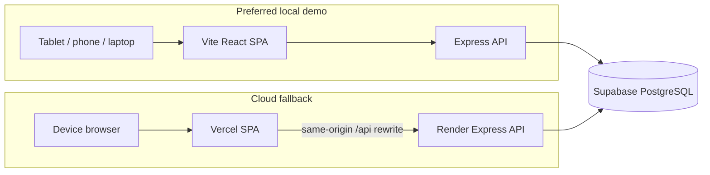
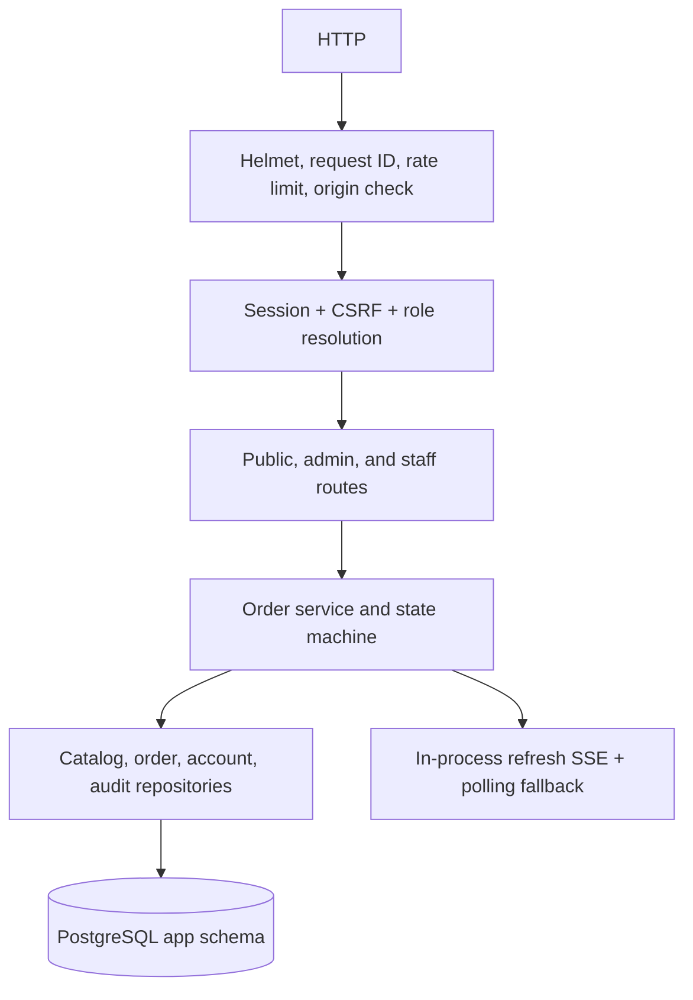

# Architecture

## Runtime topology



Local and hosted Express instances use the same PostgreSQL database. Only one
environment should be considered active for station mutations at a time; the
cloud path is a supervised fallback, not an active-active cluster.

## Repository layout

```text
apps/web                  React 18 + Vite SPA/PWA
apps/server               Express API and domain workflow
apps/server/src/db        SQLite rollback and PostgreSQL migrations/providers
apps/server/src/postgres  PostgreSQL repositories and order service
packages/shared           Shared schemas, money, constants, and seed data
scripts                   Local setup, import, backup, health, and account tools
deploy                    Local Caddy example
docs                      Operations, API, database, and test documentation
```

## Server boundaries

The API is arranged as:



The SQLite repositories and migrations remain available for rollback and the
existing local test suite. When `DATABASE_PROVIDER=postgres`, the app selects
the asynchronous PostgreSQL repositories, transaction wrapper, migrations,
and session store.

## Data integrity

- Product prices and customization compatibility are loaded server-side.
- Order items store historical product/add-on/option snapshots.
- Amounts are integer centavos.
- `daily_order_sequences` allocates order numbers atomically.
- Status and payment mutations use the expected `version` in the update
  predicate, preventing stale station devices from overwriting newer state.
- Foreign keys, check constraints, unique indexes, and report indexes are
  applied in the private `app` schema.
- Audit events record actor, role, request ID, timestamp, and deployment ID.

## Request and event behavior

The Vercel rewrite preserves a single browser origin, so cookie sessions and
relative EventSource URLs continue to work without broad CORS. The Render API
returns sanitized public-board payloads and never exposes the database
connection string or privileged Supabase credentials.

SSE is an optimization for refresh signals. Clients refetch the authoritative
queue or summary and fall back to five-second polling. This makes the system
safe across the local/cloud switch even though the two processes do not share an
in-memory event bus.

## Performance choices

- PostgreSQL pool size is bounded by `DATABASE_POOL_MAX`.
- Database statements have a timeout.
- Order detail loads items, modifiers, and options in batch queries.
- Catalog cache and fixed-count menu loading avoid query counts proportional to
  the number of products.
- Queue results are paginated and ordered oldest-first.

## Security choices

- Supabase is backend-only; no `service_role` key or database URL is shipped to
  the browser.
- The `app` schema is private and its default public grants are revoked.
- Hosted cookies require HTTPS and trusted proxy configuration.
- CSRF, role authorization, origin allowlisting, rate limiting, CSP, and
  request IDs remain enabled.
- Receipt tokens are hash-only lookup secrets.

See [DEPLOYMENT.md](DEPLOYMENT.md) for the local and hosted runbooks.
