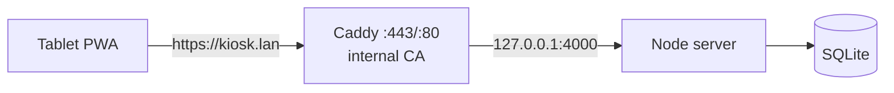

# Deployment — Local HTTPS Pilot (Android + iPadOS)

## 1. Topology



- Node binds `127.0.0.1` only — never exposed to the LAN directly.
- Caddy terminates HTTPS and reverse-proxies to Node.
- The live SQLite file must live on a **local disk**, never a network share.

## 2. Prerequisites

- Node.js LTS + the project installed and built (`npm install`,
  `npm run db:migrate`, `npm run db:seed`, `npm run admin:create`,
  `npm run build`).
- **Caddy** installed on the shop PC (external prerequisite, not bundled).
  Download from https://caddyserver.com/download (Windows amd64) and add
  `caddy.exe` to PATH.
- A **reserved/static private IP** for the shop PC on the shop Wi-Fi
  (DHCP reservation in the router, e.g. `192.168.1.50`), and a fixed
  hostname if desired (e.g. `kiosk.lan` via the router's DNS or the
  tablet's hosts file).

## 3. Configure and start Caddy

1. Copy the example:
   ```powershell
   Copy-Item deploy\Caddyfile.example Caddyfile
   ```
2. Edit `Caddyfile` and replace **KIOSK_HOST** with the kiosk hostname or
   private IP, e.g. `https://kiosk.lan` or `https://192.168.1.50`.
3. Start Caddy:
   ```powershell
   caddy start
   ```
   - Caddy auto-issues a certificate from its **internal CA**
     (`pki ca local`) on first run — no public certificate, no public
     exposure.
   - The internal root certificate is written to Caddy's data directory:
     `<caddy-data>\pki\authorities\local\root.crt`
     (Windows default: `%APPDATA%\Caddy\pki\authorities\local\root.crt`).
4. Keep Node running (`npm start` in the project root, or a service).

## 4. Locate/export the Caddy root certificate

```powershell
# Default Windows location after first `caddy start`:
Get-ChildItem "$env:APPDATA\Caddy\pki\authorities\local"
# Export a copy for the tablet (e.g. root.crt) — this file is then
# transferred to the tablet (email/cloud/USB — private network only).
```

## 5. Trust the certificate on Android

1. Copy `root.crt` to the tablet (e.g. Downloads).
2. Settings → Security & privacy → **More security settings /
   Encryption & credentials / Install a certificate** → **CA certificate**.
3. Select `root.crt`; name it e.g. "Sweet Gonz Kiosk CA".
4. Confirm the warning (this is a private pilot CA, not a public one).

> Android may label the certificate "not trusted for the internet" — that
> is expected for a private internal CA; the kiosk hostname/IP is the only
> thing it covers.

## 6. Trust the certificate on iPadOS

1. Copy `root.crt` to the iPad (AirDrop/email).
2. Open it in **Files**, tap Install when the profile prompt appears
   (Settings → Profile Downloaded).
3. Settings → General → **About → Certificate Trust Settings** → enable
   full trust for "Sweet Gonz Kiosk CA".

## 7. Android kiosk setup

1. Open the kiosk URL (`https://kiosk.lan/kiosk`) in Chrome.
2. Menu → **Add to Home screen / Install app** (PWA install).
3. **Lock to landscape**: enable auto-rotate off + the PWA runs landscape
   (manifest requests landscape orientation).
4. **App/screen pinning** (supervised use, NOT managed lock-task mode —
   this project does not implement enterprise device management):
   - Settings → Security → **Screen pinning**: enable it; require PIN to
     unpin (set a PIN in lock-screen settings first).
   - Open the kiosk PWA, then Overview → tap the app icon → **Pin**.
5. **Disable sleep**: Settings → Display → Screen timeout → 30 minutes
   (or "never" while supervised).
6. **Disable autofill/password saving**:
   - Settings → Passwords & accounts → turn off autofill/password saving.
   - Chrome: Settings → Password Manager → off.

## 8. iPadOS kiosk setup

1. Install and trust the CA profile (see §6).
2. Open the kiosk URL in **Safari** → Share → **Add to Home Screen**.
3. The PWA opens standalone, landscape (manifest orientation).
4. **Guided Access** (supervised single-app mode):
   - Settings → Accessibility → **Guided Access**: enable; set a
     **private passcode** (Settings → Guided Access → Passcode settings).
   - Open the kiosk PWA, triple-click the side/top button → **Start
     Guided Access**; triple-click again and enter the passcode to end.
5. **Disable unnecessary hardware controls** inside Guided Access:
   - Options → turn off Sleep/Wake, Volume buttons, Touch (keep Touch on
     for ordering).
6. **Display auto-lock**: Settings → Display & Brightness → Auto-Lock →
   15 minutes or Never (supervised).

## 9. Firewall (private network only)

- Allow inbound **TCP 80 and 443** only from the private LAN, e.g.:
  ```powershell
  New-NetFirewallRule -DisplayName "Kiosk HTTPS" -Direction Inbound `
    -Protocol TCP -LocalPort 443 -RemoteAddress 192.168.1.0/24 -Action Allow
  New-NetFirewallRule -DisplayName "Kiosk HTTP redirect" -Direction Inbound `
    -Protocol TCP -LocalPort 80 -RemoteAddress 192.168.1.0/24 -Action Allow
  ```
- **Do NOT** enable port forwarding on the router.
- **Do NOT** expose the shop PC to the public internet.
- Node port 4000 stays bound to 127.0.0.1 (no firewall rule needed).

## 10. After the pilot — remove the certificate

- **Android**: Settings → Security → Encryption & credentials → Trusted
  credentials → User tab → delete "Sweet Gonz Kiosk CA".
- **iPadOS**: Settings → General → VPN & Device Management → remove the
  profile; then Certificate Trust Settings → disable trust.
- Remove the Caddy internal CA data if the machine is decommissioned:
  delete the `pki` folder under Caddy's data directory.
- Revoke nothing publicly — the CA never left the private network.

## 11. First-run verification checklist

- [ ] `https://kiosk.lan/kiosk` loads with a valid (private CA) padlock.
- [ ] HTTP redirects to HTTPS.
- [ ] Admin console works over HTTPS; session cookie is Secure.
- [ ] Kiosk PWA installs; offline shell loads; checkout disabled offline.
- [ ] Tablet locked in landscape; pinning/Guided Access active.
- [ ] Firewall rules limited to the private LAN; no port forwarding.
