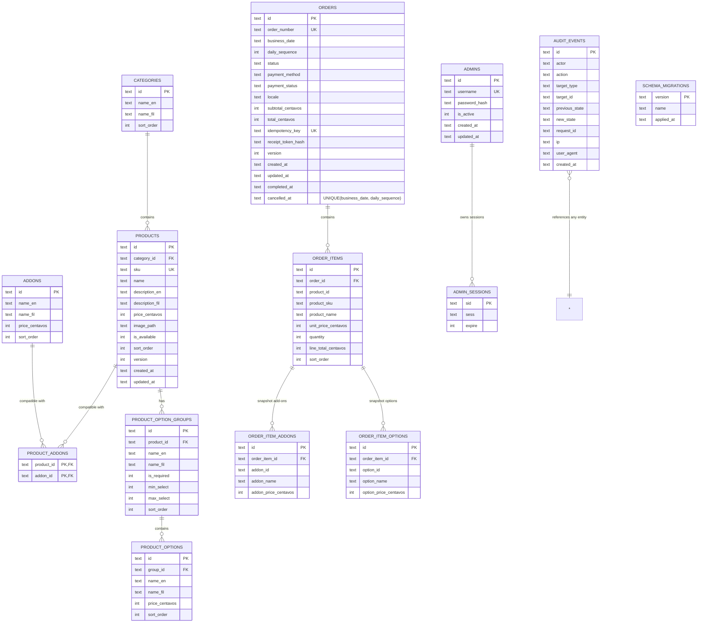

# Entity-Relationship Diagram

## ERD

## Notes

- **Products/Add-ons/Options** keep `*_en` / `*_fil` display names; product
  names are intentionally single-language (never translated).
- **Order item snapshots** (name, SKU, unit price, add-on/option names and
  prices) guarantee historical receipts do not change after menu edits.
- **Money** is stored as integer centavos everywhere.
- **Orders** enforce:
  - `UNIQUE(order_number)`
  - `UNIQUE(business_date, daily_sequence)`
  - `UNIQUE(idempotency_key)`
- **admin_sessions** stores the express-session JSON; `expire` mirrors the
  cookie expiry for pruning; the session payload also carries the absolute
  8-hour deadline.
- **audit_events** stores JSON strings for previous/new state; never stores
  passwords, session IDs, CSRF tokens, or receipt tokens.
- **schema_migrations** is managed by the migration runner
  (`apps/server/src/db/migrate.js`); migrations live in
  `apps/server/src/db/migrations/`.

See DATABASE_DICTIONARY.md for column-level details and types.
