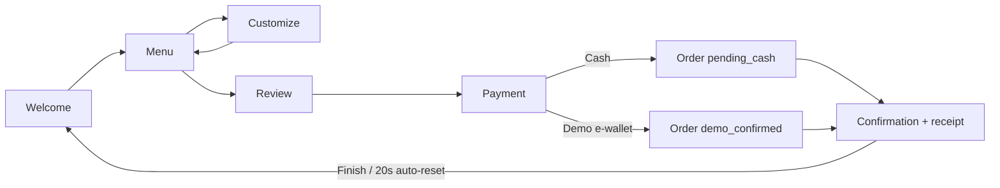
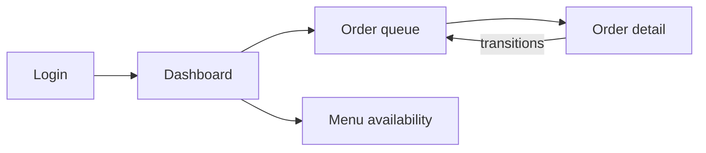

# Use Cases

## Actors

- **Customer** — uses the kiosk tablet.
- **Staff / Admin** — uses the admin console.
- **Operator** — installs and maintains the system.

---

## Customer use cases

### UC-01 Start a session

**Actor:** Customer — **Precondition:** kiosk shows the welcome screen.

1. Customer selects English or Filipino (default English).
2. Customer taps **Start Order / Simulan ang Order**.
3. Any previous completed session is cleared; the menu opens.
   **Postcondition:** Fresh cart; menu visible.

### UC-02 Browse and search the menu

1. Customer browses categories (horizontally scrollable below 1024 px) or
   types in the search box.
2. Sold-out products remain visible, disabled, marked **Sold out / Ubos na**.
   **Postcondition:** Matching products displayed.

### UC-03 Customize and add a product

1. Customer taps **Customize / I-customize** on a product.
2. Customer picks required choices (e.g., fries flavor) and optional add-ons.
3. Customer sets quantity (1–20); the line total updates live.
4. Customer taps **Add to cart / Idagdag sa cart**.
   **Alternatives:**

- Required choice missing → add-to-cart is disabled with an inline message.
- Quantity out of range → validation message.
  **Postcondition:** Line added (identical configurations merge).

### UC-04 Review and edit the cart

1. Customer opens the cart (panel ≥1024 px, drawer below).
2. Customer increases/decreases quantities, removes lines, or clears the
   cart (with confirmation).
   **Postcondition:** Cart reflects edits; totals update.

### UC-05 Place a cash order

1. Customer reviews the order and continues to payment.
2. Customer chooses **Cash** and confirms.
3. The order is created as `pending_cash`; the confirmation screen shows the
   order number and the instruction to pay at the counter.
   **Postcondition:** Order `placed` + `pending_cash`; receipt printable; kiosk
   auto-resets after 20 s.

### UC-06 Place a demo e-wallet order (simulated)

1. Customer chooses **Demo E-Wallet**.
2. A clearly labeled demo QR and `DEMO-XXXXXXXX` reference appear with
   prominent EN/FIL "DEMO ONLY — NOT A REAL PAYMENT" warnings.
3. Customer confirms; the order is created as `demo_confirmed`.
   **Postcondition:** Order `placed` + `demo_confirmed` (simulated); receipt
   carries the demo notice.

### UC-07 Print the receipt

1. On the confirmation screen the customer (or staff) taps **Print**.
2. Only the receipt area prints (dedicated print stylesheet).

### UC-08 Kiosk timeout recovery

1. 105 s without activity → warning with a 15 s countdown.
2. Customer taps **I'm still here** → session continues.
3. Otherwise the kiosk resets at 120 s to the welcome screen and clears
   storage.
   **Note:** The reset never happens while an order submission is pending.

### UC-09 Server unavailable

1. The kiosk detects the server is unreachable.
2. A bilingual banner appears; the cart is preserved; checkout is disabled.
3. When the connection returns, the customer can retry and continue.
   **Postcondition:** No order is silently queued.

### UC-10 Accidental refresh mid-order

- The unsubmitted cart is restored from `sessionStorage`.
- Resubmission reuses the same idempotency key; a duplicate response shows
  the original order (never two orders).

---

## Admin use cases

### UC-11 Sign in

1. Staff opens `/admin/login`, enters username/password.
2. Valid credentials → session regenerated, CSRF token issued, redirected
   to `/admin`.
   **Alternatives:**

- Invalid credentials → generic error (no user enumeration).
- 5 failed attempts per IP+username in 15 min → 429 with Retry-After.
  **Postcondition:** Authenticated session (30-min inactivity, 8-h absolute).

### UC-12 View today's dashboard

1. Staff opens the dashboard.
2. Counts: total orders, pending cash, placed, preparing, ready, completed,
   cancelled, completed sales (cash + demo split, demo labeled simulated).
3. Connection status pill (live SSE / polling / offline).

### UC-13 Monitor the order queue

1. Staff opens Orders.
2. Newest-first list with number, time, payment, total, status, elapsed.
3. Filters: status, payment, date, exact order-number search.
4. Updates arrive via SSE with 5 s polling fallback.

### UC-14 Progress an order

1. Staff opens an order and taps **Start preparing / Mark ready /
   Complete**.
2. A confirmation dialog asks before the transition.
3. The API validates the transition and the record version.
   **Alternatives:**

- Invalid transition → 409, newest state shown, localized message.
- Cash order completed without `cash_received` → rejected with
  `PAYMENT_NOT_CONFIRMED`.
- Stale version → 409 `STALE_VERSION`, state refreshed.

### UC-15 Confirm cash payment

1. For a cash order with `pending_cash`, staff taps **Confirm cash
   received**.
2. The order moves to `cash_received` (audited).

### UC-16 Cancel an order

1. From placed/preparing/ready, staff taps **Cancel order** and confirms.
2. The order becomes `cancelled` and cannot be reopened.

### UC-17 Control menu availability

1. Staff opens Menu, searches/filters products.
2. Staff marks a product **Sold out / Ubos na** or **Available**.
3. The kiosk reflects the change immediately (sold-out cards disabled).
4. Last-update time is displayed; stale updates return 409.

---

## Operator use cases

### UC-18 Create an admin account

`npm run admin:create` (interactive; hidden password; no defaults).

### UC-19 Back up the database

`npm run backup` — timestamped, integrity-verified, newest 7 retained.

### UC-20 Restore a backup

`npm run restore -- <backup> --confirm-restore` — quarantines the current
DB, refuses while the server runs, verifies integrity + migrations, prints
the latest order for confirmation.

### UC-21 Health check

`npm run healthcheck` — DB integrity, migrations, seed, admin existence,
HTTP endpoint.

### UC-22 Deploy HTTPS on the LAN

Install Caddy, use `deploy/Caddyfile.example`, trust the internal CA on the
tablet, restrict the firewall to the private network (see DEPLOYMENT.md).

---

## Customer flow (Mermaid)

## Admin flow (Mermaid)

